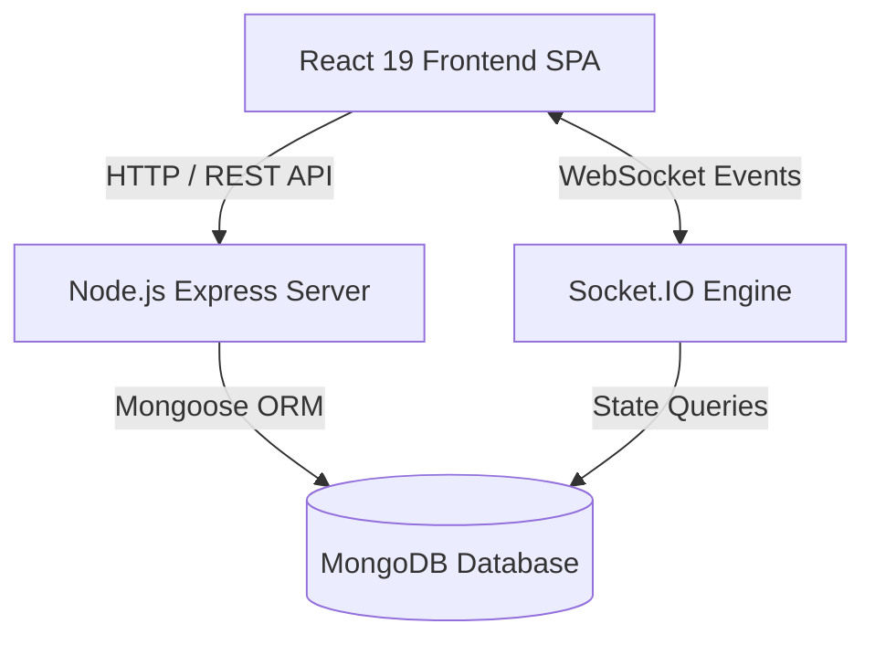
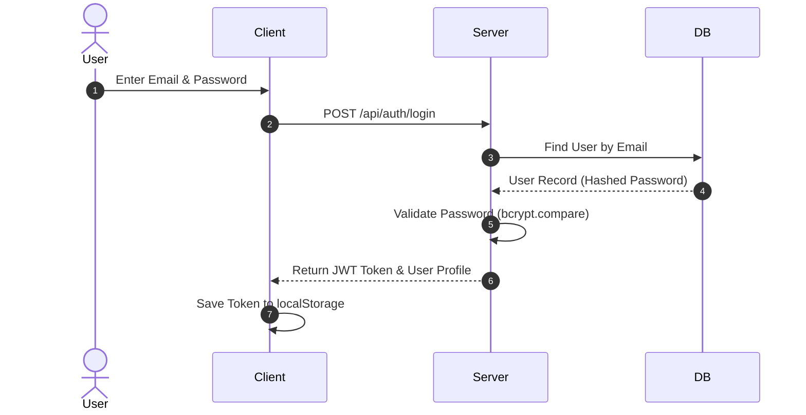
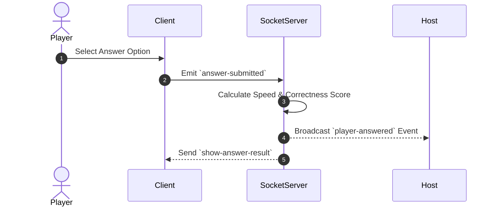
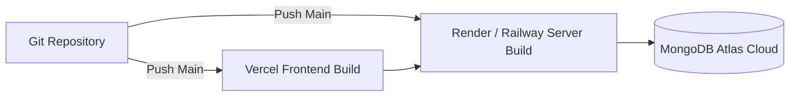

# Corporate Technical, Functional & Operations Documentation
## Project: Fourise Quiz Hub (Real-time Quiz Hub System)

---

## 1. Project Overview

Fourise Quiz Hub is an enterprise-grade, real-time multiplayer quiz platform (similar to Kahoot) built on a modern JavaScript stack. It allows hosts to create interactive, timed quizzes, generate unique PINs and QR codes for live game sessions, stream live questions, process player answers in real-time, compute live rankings, and archive detailed performance analytics for post-game reporting.

### 1.1 Target Users
* **Quiz Hosts / Educators / Corporate Trainers:** Users who register to create custom quizzes, host live interactive sessions, monitor participant performance, and export detailed PDF/Excel reports.
* **Players / Participants / Students:** End users who join live quiz sessions on mobile or desktop without needing registration, by scanning a QR code or entering a 6-digit PIN.
* **System Administrators:** Engineers responsible for deploying, maintaining, scaling, and monitoring the Fourise Quiz Hub backend services and database.

### 1.2 Key Features
* **Authentication & Recovery:** JWT-based stateless authentication with password reset supported via SMTP email or hashed security questions.
* **Interactive Quiz Authoring:** Creation and editing of quizzes featuring customizable time limits (default 60s), exact 4-option single-choice questions, and rich background image support.
* **Real-time Game Orchestration:** WebSockets powered by Socket.IO for low-latency player lobby updates, synchronized question countdowns, live answer submissions, and mid-game leaderboards.
* **QR Code & PIN Join Engine:** Automatic generation of unique 6-digit numeric PINs and embedded base64 QR codes for frictionless mobile onboarding.
* **Scoring & Analytics Engine:** Automated time-weighted scoring calculations, detailed answer correctness tracking, winner detection, and persistent results storage.
* **Reporting & Exporting:** Client-side generation of Excel spreadsheet (`.xlsx`), PDF (`.pdf`), and Word (`.docx`) report files.
* **Responsive UI & Dynamic Themes:** Framer Motion animated state transitions, customizable theme background switcher, and light/dark visual accents.

---

## 2. Technology Stack

* **Frontend Framework:** React 19 + Vite 8
* **Frontend Routing & State:** React Router DOM v7, TanStack React Query v5, React Context API (`ThemeContext`, `GameContext`)
* **Styling & Icons:** Tailwind CSS v3, Lucide React icons, Framer Motion v12, Canvas Confetti
* **Backend Runtime & Framework:** Node.js + Express v5 (CommonJS)
* **Realtime Protocol:** Socket.IO v4 (WebSockets)
* **Database & ORM:** MongoDB Atlas / Local MongoDB, Mongoose v9 (`mongodb-memory-server` fallback for local dev)
* **Authentication & Cryptography:** JSON Web Tokens (`jsonwebtoken`), `bcryptjs` (salt factor 10)
* **Export Utilities:** `xlsx`, `jspdf`, `jspdf-autotable`, `docx`
* **Network & Tunneling Tools:** `@ngrok/ngrok`, `localtunnel`

### 2.1 Databases & Services

| Service / DB | Technology | Purpose |
|---|---|---|
| **Primary Database** | MongoDB Atlas / Mongoose | Persistent storage of Users, Quizzes, GameSessions, Results, Plans, FAQs |
| **Development DB Fallback** | `mongodb-memory-server` | In-memory MongoDB instance for offline local development fallback |
| **Realtime Engine** | Socket.IO Server | Bi-directional event broadcasting for lobby state, countdowns, and leaderboards |
| **Email Service** | Nodemailer (SMTP) | Delivery of password reset tokens and verification communications |
| **Static Asset Engine** | Express Static / Vite Public | Hosting avatars, background images, and compiled SPA bundles |

---

## 3. Project Architecture

Fourise Quiz Hub operates on a Client-Server architecture with dual communication channels:
1. **HTTP/REST API Layer:** Standard stateless endpoints handling user management, quiz CRUD operations, initial game initialization, and analytical reporting.
2. **WebSocket / Socket.IO Layer:** State-full persistent connections executing real-time game state synchronization.

```
       +-------------------------------------------------------+
       |               React 19 SPA (Client)                  |
       |  - React Router DOM   - React Query   - Socket Client |
       +--------------------------+----------------------------+
                                  |
            +---------------------+---------------------+
            | HTTP / REST API                           | WebSockets / Socket.IO
            v                                           v
+-----------------------+                    +-----------------------+
|  Express 5 App Server |                    | Socket.IO Event Engine|
|  - Auth Middleware    |                    | - Room Management     |
|  - Route Handlers     |                    | - Timer Sync          |
+-----------+-----------+                    +-----------+-----------+
            |                                            |
            +---------------------+----------------------+
                                  | Mongoose Models
                                  v
                    +---------------------------+
                    |      MongoDB Database     |
                    | (Users, Quizzes, Sessions)|
                    +---------------------------+
```

### 3.1 Request / Data Flow
1. **Client Action:** Host creates a quiz or joins a session.
2. **API Request:** Client sends HTTPS request with optional `Authorization: Bearer <token>` header.
3. **Express Middleware:** Validates JWT, populates `req.user`, and routes request to controller logic.
4. **Database Mutation:** Mongoose executes queries against MongoDB.
5. **Realtime Broadcast:** Controllers access `req.app.get('io')` or direct socket handlers to push updates to all connected room sockets.

### 3.2 Attendance Check-in Flow (Game PIN & Player Join)

In Fourise Quiz Hub, player check-in operates similarly to an event attendance flow:

```
[ Player Device ]             [ Express Backend ]            [ Socket.IO Engine ]        [ Host Device ]
       |                               |                              |                         |
       |--- 1. POST /api/game/join --->|                              |                         |
       |    (PIN, Name, Avatar)        |                              |                         |
       |                               |-- 2. Validate PIN & Session -|                         |
       |<-- 3. Return Session JSON ----|                              |                         |
       |                               |                              |                         |
       |--- 4. Socket `player-join` --------------------------------->|                         |
       |    (room: PIN, playerName)    |                              |                         |
       |                               |                              |-- 5. Socket Broadcast ->|
       |                               |                              |    `player_list`        |
       |                               |                              |    (Updated Players)    |
```

---

## 4. Repository / Git Details

* **Root Directory:** `Fourise Quiz Hub (QuizForge)/`
* **Monorepo Structure:** Multi-package repository (`client/`, `server/`, `postman/`, `docs/`) managed with npm scripts.
* **Entry Script (Server):** `server/index.js`
* **Entry Script (Client):** `client/src/main.jsx`

### 4.1 Git Ignore / Sensitive Files

The repository strictly excludes environment secrets, transient build outputs, and local dependencies via `.gitignore` files at both root, client, and server levels.

**Excluded Patterns:**
* `node_modules/`
* `.env` / `.env.local` / `.env.production`
* `dist/` / `build/`
* `.DS_Store` / `npm-debug.log*`

> [!WARNING]
> Secrets such as `MONGO_URI`, `JWT_SECRET`, and `EMAIL_PASS` must NEVER be committed to Git repositories. Ensure `.env` is listed in `.gitignore`.

---

## 5. Complete Folder Structure

```text
Fourise-Quiz-Hub/
├── .gitignore
├── package.json
├── package-lock.json
├── README.md
├── docs/
│   ├── HANDOFF.md
│   └── Corporate_Documentation.md
├── postman/
│   └── (Postman collection & environment export files)
├── client/
│   ├── index.html
│   ├── package.json
│   ├── postcss.config.js
│   ├── tailwind.config.js
│   ├── vite.config.js
│   ├── vercel.json
│   ├── .env.example
│   ├── public/
│   │   ├── avatars/
│   │   └── favicon.ico
│   └── src/
│       ├── App.css
│       ├── App.jsx
│       ├── index.css
│       ├── main.jsx
│       ├── api/
│       │   └── config.js
│       ├── components/
│       │   ├── AnimatedPage.jsx
│       │   ├── Avatar.jsx
│       │   ├── BackgroundPicker.jsx
│       │   ├── DemoModal.jsx
│       │   ├── Footer.jsx
│       │   ├── Logo.jsx
│       │   ├── Navbar.jsx
│       │   ├── PlanComparisonTable.jsx
│       │   ├── QuickRegisterModal.jsx
│       │   ├── ReportsModal.jsx
│       │   ├── Sidebar.jsx
│       │   ├── ThemeBackground.jsx
│       │   ├── ThemeSelector.jsx
│       │   └── landing/
│       ├── context/
│       │   ├── GameContext.jsx
│       │   └── ThemeContext.jsx
│       ├── pages/
│       │   ├── AnswerResult.jsx
│       │   ├── CreateQuiz.jsx
│       │   ├── Dashboard.jsx
│       │   ├── EditQuiz.jsx
│       │   ├── FinalResult.jsx
│       │   ├── ForgotPassword.jsx
│       │   ├── HostLobby.jsx
│       │   ├── JoinGame.jsx
│       │   ├── LandingPage.jsx
│       │   ├── Leaderboard.jsx
│       │   ├── LiveQuiz.jsx
│       │   ├── Login.jsx
│       │   ├── MyQuizzes.jsx
│       │   ├── Register.jsx
│       │   ├── ResetPassword.jsx
│       │   ├── ResultsAnalytics.jsx
│       │   └── WaitingRoom.jsx
│       ├── services/
│       │   ├── api.js
│       │   ├── authService.js
│       │   ├── gameService.js
│       │   ├── infoService.js
│       │   ├── quizService.js
│       │   ├── resultService.js
│       │   └── socketService.js
│       └── themes/
│           └── index.js
└── server/
    ├── package.json
    ├── index.js              (Active Server Entry Point)
    ├── server.js             (Deprecated - Do not run)
    ├── .env.example
    ├── config/
    │   └── db.js
    ├── controllers/
    │   ├── authController.js
    │   ├── gameController.js
    │   ├── imageController.js
    │   ├── infoController.js
    │   ├── quizController.js
    │   └── resultController.js
    ├── middleware/
    │   └── authMiddleware.js
    ├── models/
    │   ├── FAQ.js
    │   ├── GameSession.js
    │   ├── Plan.js
    │   ├── Quiz.js
    │   ├── Result.js
    │   └── User.js
    ├── routes/
    │   ├── authRoutes.js
    │   ├── gameRoutes.js
    │   ├── imageRoutes.js
    │   ├── infoRoutes.js
    │   ├── quizRoutes.js
    │   └── resultRoutes.js
    ├── socket/
    │   └── index.js
    ├── tests/
    │   ├── auth.test.js
    │   └── serverStartup.test.js
    └── utils/
        └── sendEmail.js
```

---

## 6. Frontend Documentation

### 6.1 Frontend Design / UX Surfaces
* **UI Architecture:** Component-driven Single Page Application built with React 19 and styled via Tailwind CSS.
* **Theme System:** `ThemeContext` provides theme state across the app, enabling real-time toggling between dark, light, and custom visual themes.
* **State Management:** `GameContext` manages active session state (PIN, player list, current question index, total questions, scoring state). React Query handles caching and REST state management.
* **UX Feedback:** Toast notifications via `react-hot-toast`, animated modal backdrops via `framer-motion`, and winner celebratory particle effects via `canvas-confetti`.

---

## 7. Page-by-Page Documentation

### 7.1 Public / Authentication
* **`LandingPage.jsx` (`/`):** Public hero screen introducing Fourise Quiz Hub features, pricing plan matrix, FAQs, and navigation triggers to Login/Register or quick-join.
* **`Login.jsx` (`/login`):** User authentication interface validating email/password and persisting JWT tokens to `localStorage.token`.
* **`Register.jsx` (`/register`):** User sign-up page capturing name, email, password, and security question/answer pair.
* **`ForgotPassword.jsx` (`/forgot-password`):** Multi-step account recovery flow supporting either email SMTP recovery links or security question verification.
* **`ResetPassword.jsx` (`/reset-password/:token`):** Final password update interface for token-verified users.

### 7.2 Host / Creator Portal
* **`Dashboard.jsx` (`/dashboard`):** Main control center for logged-in hosts displaying created quizzes, total games hosted, participant totals, and quick actions.
* **`CreateQuiz.jsx` (`/quiz/create`):** Interactive builder for adding questions, specifying 4 options, selecting correct answers, setting time limits, and uploading background artwork.
* **`EditQuiz.jsx` (`/quiz/edit/:id`):** Modifier page for existing user-owned quizzes.
* **`MyQuizzes.jsx` (`/quiz/my`):** Library view listing created quizzes with options to launch, edit, duplicate, or delete.

### 7.3 Host Analytics & Game Control
* **`HostLobby.jsx` (`/host/lobby/:pin`):** Host control tower presenting generated 6-digit PIN, dynamic QR Code, real-time list of joined players, and the "Start Game" trigger.
* **`ResultsAnalytics.jsx` (`/results/:sessionId`):** Deep-dive reporting screen showing accuracy breakdowns, per-question stats, leaderboard tables, and PDF/Excel export triggers.

### 7.4 Player Experience & Live Quiz
* **`JoinGame.jsx` (`/join`):** PIN entry screen with avatar selection for guest participants.
* **`WaitingRoom.jsx` (`/waiting/:pin`):** Player staging area showing joined avatar and waiting status prior to host launching question 1.
* **`LiveQuiz.jsx` (`/live/:pin`):** Timed question display presenting the question prompt, visual options, remaining seconds timer, and answer touch targets.
* **`AnswerResult.jsx` (`/result/answer/:pin`):** Instant answer feedback showing correctness, points earned, speed bonus, and overall streak.
* **`Leaderboard.jsx` (`/leaderboard/:pin`):** Interim leaderboard screen displayed between questions.
* **`FinalResult.jsx` (`/final-result/:pin`):** Podium screen announcing 1st, 2nd, and 3rd place winners with confetti animations.

---

## 8. Dashboard Documentation

### 8.1 Dashboard Capabilities
* **Metrics Summary:** Displays total quizzes created, games hosted, unique participants, and average player scores.
* **Quick Launch:** One-click session creation from any quiz card.
* **Quiz Management Grid:** Filter, search, and perform CRUD operations on owned quizzes.
* **Recent Activity Feed:** Direct access to past session analytical reports.

---

## 9. Backend Documentation

### 9.1 Backend Layering

The Express backend strictly separates network transport, request authorization, domain logic, database persistence, and WebSocket broadcasting.

```
       +-------------------------------------------------+
       |         HTTP Request / Socket Event             |
       +------------------------+------------------------+
                                |
                                v
       +-------------------------------------------------+
       |           Middleware / JWT Auth Validation      |
       +------------------------+------------------------+
                                |
                                v
       +-------------------------------------------------+
       |              Controller Logic                   |
       +------------------------+------------------------+
                                |
             +------------------+------------------+
             |                                     |
             v                                     v
+--------------------------+          +--------------------------+
|   Mongoose DB Models     |          | Socket.IO Broadcaster    |
+--------------------------+          +--------------------------+
```

---

## 10. API Documentation

All REST routes are dual-mounted on both root prefixes (e.g., `/auth`, `/quiz`) and `/api` prefixes (e.g., `/api/auth`, `/api/quiz`). **Use `/api` routes in client implementations.**

### 10.1 Critical Endpoint Examples

#### Authentication: `/api/auth`
* `POST /api/auth/register`: Create user account.
* `POST /api/auth/login`: Authenticate user; returns JWT token.
* `GET /api/auth/profile` *(Protected)*: Fetch logged-in user profile.
* `POST /api/auth/forgot-password`: Initiate password recovery.
* `POST /api/auth/verify-security-answer`: Verify security question answer.
* `POST /api/auth/reset-password`: Set new password.

#### Quizzes: `/api/quiz`
* `GET /api/quiz/list`: Retrieve public active quizzes.
* `GET /api/quiz/user/myquizzes` *(Protected)*: Retrieve quizzes created by caller.
* `GET /api/quiz/:id`: Retrieve single quiz structure.
* `POST /api/quiz/create` *(Protected)*: Save new quiz.
* `PUT /api/quiz/:id` *(Protected)*: Update owned quiz.
* `DELETE /api/quiz/:id` *(Protected)*: Remove owned quiz.

#### Game Engine: `/api/game`
* `POST /api/game/create` *(Protected)*: Initialize game session and generate PIN + QR code.
* `POST /api/game/join`: Register guest player into session by PIN.
* `GET /api/game/:pin`: Fetch active session details.
* `POST /api/game/startquestion` *(Protected)*: Advance session to next question.
* `POST /api/game/answer`: Submit player choice and compute score.
* `POST /api/game/end` *(Protected)*: Terminate session and compile final leaderboard.

#### Results: `/api/result`
* `POST /api/result/save` *(Protected)*: Persist finished game result.
* `GET /api/result/my` *(Protected)*: List past game results for host.
* `GET /api/result/:sessionId`: Retrieve full session analytics report.

---

## 11. Database Documentation

### 11.1 Database Design Characteristics
* **ORM:** Mongoose 9 schemas mapping JavaScript objects to MongoDB BSON documents.
* **Data Normalization:** Core entities (`User`, `Quiz`, `GameSession`, `Result`) reside in separate collections connected via `ObjectId` references (`ref: 'User'`, `ref: 'Quiz'`).
* **Embedded Subdocuments:** Questions are embedded directly inside `Quiz` documents, and Player Answers are embedded inside `GameSession` and `Result` documents for high-speed atomic reads.

---

## 12. Collection / Table Mapping

| Collection Name | Schema File | Key Fields | Description |
|---|---|---|---|
| `users` | `server/models/User.js` | `name`, `email` (unique), `password` (hash), `securityQuestion`, `securityAnswer` (hash) | Registered host accounts |
| `quizzes` | `server/models/Quiz.js` | `title`, `category`, `createdBy` (FK User), `questions` (Array), `isActive` | Quiz templates and question banks |
| `gamesessions` | `server/models/GameSession.js` | `pin` (unique), `quizId` (FK Quiz), `hostId` (FK User), `players` (Array), `status` | Active live game state |
| `results` | `server/models/Result.js` | `sessionId` (FK GameSession), `quizId`, `hostId`, `players` (Array), `winner` | Archived past game analytics |
| `plans` | `server/models/Plan.js` | `name`, `price`, `billingCycle`, `features`, `isActive` | Pricing tier configurations |
| `faqs` | `server/models/FAQ.js` | `question`, `answer`, `category`, `displayOrder` | System Help / FAQ records |

---

## 13. Authentication & Authorization

### 13.1 Role Token Model
* **Mechanism:** JSON Web Token (JWT) signed using HMAC SHA256 (`JWT_SECRET`).
* **Expiration:** Configured via `JWT_EXPIRE` (e.g., `7d`).
* **Header Format:** `Authorization: Bearer <token>`
* **Middleware (`authMiddleware.js`):**
  1. Extracts token from `Authorization` header.
  2. Verifies token integrity using `JWT_SECRET`.
  3. Decodes user ID payload and attaches model to `req.user`.
  4. Returns `401 Unauthorized` for missing/invalid tokens.

---

## 14. User & Role Management

### 14.1 Navigation
* **Public / Guest Player:** Allowed access to `/`, `/login`, `/register`, `/join`, `/waiting/:pin`, `/live/:pin`, `/result/answer/:pin`, `/leaderboard/:pin`, `/final-result/:pin`.
* **Authenticated Host:** Granted access to `/dashboard`, `/quiz/create`, `/quiz/edit/:id`, `/quiz/my`, `/host/lobby/:pin`, `/results/:sessionId`.

---

## 15. Module Documentation

* **Auth Module (`authController.js`, `authRoutes.js`):** Handles registration, login, security question verification, and JWT generation.
* **Quiz Engine Module (`quizController.js`, `quizRoutes.js`):** Manages quiz CRUD operations, schema validation, and ownership enforcement.
* **Realtime Game Module (`gameController.js`, `socket/index.js`):** Orchestrates PIN generation, room creation, question timer countdowns, and score calculations.
* **Analytics & Result Module (`resultController.js`, `resultRoutes.js`):** Persists post-game summaries and serves aggregation APIs.
* **Export Engine (`client/src/components/ReportsModal.jsx`):** Generates download files in `.xlsx`, `.pdf`, and `.docx` formats.

---

## 16. Feature-to-Database Mapping

| Feature | Frontend Route | Backend Endpoint | Mongoose Collection |
|---|---|---|---|
| User Login | `/login` | `POST /api/auth/login` | `users` |
| Create Quiz | `/quiz/create` | `POST /api/quiz/create` | `quizzes` |
| Launch Game Session | `/dashboard` | `POST /api/game/create` | `gamesessions` |
| Player PIN Join | `/join` | `POST /api/game/join` | `gamesessions` |
| Submit Live Answer | `/live/:pin` | `POST /api/game/answer` | `gamesessions` |
| Archive Results | `/final-result/:pin` | `POST /api/result/save` | `results` |
| View Analytics | `/results/:sessionId` | `GET /api/result/:sessionId` | `results` |

---

## 17. Complete Business Workflow

### 17.1 End-to-End User Journey (Registration → Quiz Creation → Live Game → Results)

```
 [1. Host Sign Up] -----> [2. Create Quiz] -----> [3. Launch Session] -----> [4. PIN / QR Code Generated]
                                                                                      |
 [7. Analytics Report] <-- [6. Game End Podium] <-- [5. Live Questions & Scores] <----+ (Players Join via PIN)
```

1. **Host Registration:** Host creates an account at `/register`.
2. **Quiz Creation:** Host authors a quiz with questions, options, time limits, and correct answers.
3. **Session Initialization:** Host clicks "Host Game" on a quiz card. Express backend generates a random unique 6-digit PIN and base64 QR code, storing state in `GameSession`.
4. **Lobby & Player Join:** Host opens `/host/lobby/:pin`. Players enter PIN at `/join`. Socket.IO broadcasts updated player lists live to the host screen.
5. **Live Gameplay:** Host triggers "Start Game". Socket.IO emits `show-question` events. Players select answers on their phones/desktops. Points are computed dynamically based on answer correctness and response speed.
6. **Leaderboards & Podium:** Mid-game rankings appear between questions. Upon completion, top 3 players are highlighted on the podium screen with confetti animations.
7. **Analytics Archiving:** Session results are persisted to `Result` collection and exported to PDF or Excel.

### 17.2 Admin Workflow
Host controls game flow manually from the host controls on `HostLobby.jsx` / `LiveQuiz.jsx`:
- **Start Game** → **Next Question** → **Show Leaderboard** → **End Game**.

---

## 18. Third-Party Integrations

* **Nodemailer:** Transports email verification and reset tokens over SMTP.
* **QRCode (`qrcode`):** Renders base64 data URIs representing game join links.
* **Socket.IO:** Facilitates real-time WebSocket messaging.
* **Canvas Confetti:** Triggers visual animations upon quiz completion.
* **Excel / PDF / Word Exporters:** Uses `xlsx`, `jspdf`, `jspdf-autotable`, and `docx` directly inside the browser.

---

## 19. File & Storage Management

* **Image Uploads:** Handled via base64 encoded strings or HTTP image URLs stored directly inside question/quiz documents.
* **Image Routes (`server/routes/imageRoutes.js`):** Endpoint helpers for processing and serving image resources.

---

## 20. Security

### 20.1 Security Priority Actions

> [!IMPORTANT]
> The following security updates are recommended before public production deployment:

1. **CORS Hardening:** Modify `server/index.js` to replace `origin: '*'` with explicit domain origin allowlists (`FRONTEND_URL`).
2. **Rate Limiting:** Implement `express-rate-limit` on `/api/auth/login`, `/api/auth/register`, and `/api/game/join` to prevent brute-force attacks.
3. **Secret Key Rotation:** Ensure `JWT_SECRET` is set to a long, random string in production environments.
4. **Input Sanitization:** Add schema validation (e.g., `zod` or `joi`) to prevent NOSQL injection attacks via JSON request payloads.

---

## 21. Performance

* **Vite Bundling:** Code splitting and asset optimization for fast initial page load times.
* **Socket Event Efficiency:** Sockets join room channels matching game PINs (`room_<PIN>`), eliminating global payload overhead.
* **React Query Caching:** Reduces duplicate REST fetches during user navigation.

---

## 22. Deployment

### 22.1 Deployment Sequence

#### Backend Deployment (Render / Railway / Heroku / AWS / VPS)
1. Set Environment Variables in host dashboard (`MONGO_URI`, `JWT_SECRET`, `JWT_EXPIRE`, `PORT`).
2. Deployment command: `npm --prefix server install && npm start`.
3. Verify HTTP health check at `https://<your-backend-domain>/`.
4. Ensure provider supports WebSocket upgrading for Socket.IO.

#### Frontend Deployment (Vercel / Netlify / Cloudflare Pages)
1. Build command: `npm --prefix client install && npm --prefix client run build`.
2. Output directory: `client/dist`.
3. Set Environment Variable: `VITE_API_URL=https://<your-backend-domain>/api`.
4. Configure SPA fallback rewriting (`client/vercel.json` provided).

---

## 23. CI/CD

Automated checking commands to run in continuous integration pipelines:

```bash
# 1. Client Linting
npm --prefix client run lint

# 2. Client Build Verification
npm --prefix client run build

# 3. Server Unit Tests Execution
node --test server/tests/*.test.js
```

---

## 24. Configuration

### 24.1 Key Environment Variables

#### Server Environment (`server/.env`)

| Variable | Required | Default | Description |
|---|---|---|---|
| `PORT` | No | `5000` | HTTP Server Port |
| `HOST` | No | `0.0.0.0` | Server Network Interface |
| `MONGO_URI` | **Yes** | N/A | MongoDB Atlas connection string |
| `JWT_SECRET` | **Yes** | N/A | Secret key for signing authentication tokens |
| `JWT_EXPIRE` | **Yes** | `7d` | Lifetime of JWT session token |
| `FRONTEND_URL` | No | `http://localhost:5173` | Client origin URL |
| `EMAIL_HOST` | No | N/A | SMTP Mail Host |
| `EMAIL_PORT` | No | `587` | SMTP Mail Port |
| `EMAIL_USER` | No | N/A | SMTP Username |
| `EMAIL_PASS` | No | N/A | SMTP Password |

#### Client Environment (`client/.env.local`)

| Variable | Required | Default | Description |
|---|---|---|---|
| `VITE_API_URL` | Recommended | Derived from browser host | Base URL of backend REST API ending in `/api` |

---

## 25. Error Handling & Logging

### 25.1 Operational Monitoring
* **Environment Validation:** `server/index.js` checks required env variables on startup and halts execution if critical variables (`MONGO_URI`, `JWT_SECRET`, `JWT_EXPIRE`) are missing.
* **Port Conflict Handler:** Automatically increments target port (`5000` -> `5001`) if `EADDRINUSE` is detected.
* **Database Connection Resilience:** Sets Google DNS servers (`8.8.8.8`, `1.1.1.1`) to resolve MongoDB Atlas `ECONNREFUSED` issues on local networks.

---

## 26. Reports & Analytics

* **Session Summary Metrics:** Accuracy percentage, total participants, top scorer, question-by-question response breakdown.
* **Client-Side Export Engine:**
  - **Excel (`.xlsx`):** Multi-tab workbook containing player rankings and detailed answer logs.
  - **PDF (`.pdf`):** Formatted report document generated using `jspdf-autotable`.
  - **Word (`.docx`):** Document layout for printing and archiving.

---

## 27. Notifications

### 27.1 Notification Triggers
* **Authentication Feedback:** Success toasts on login/register, error toasts on invalid credentials.
* **Game Events:** Visual alert toasts when players join, leave, or submit answers.
* **Validation Alerts:** Toast alerts when quiz forms missing required fields or invalid options are encountered.

---

## 28. Testing

* **Server Test Runner:** Executes tests in `server/tests/` via Node's native test runner (`node --test`).
* **Manual Verification Checklist:**
  1. Register new host account & log in.
  2. Create a new 4-option quiz.
  3. Launch game session; confirm PIN & QR code generation.
  4. Open `/join` in incognito browser window, enter PIN & name.
  5. Start question, submit answer, verify timer countdown & leaderboard update.
  6. Finish game and verify analytics report at `/results/:sessionId`.

---

## 29. Dependencies

### Root Package (`package.json`)
* **DevDependencies:** `concurrently`, `nodemon`

### Server Package (`server/package.json`)
* **Dependencies:** `express`, `mongoose`, `socket.io`, `jsonwebtoken`, `bcryptjs`, `cors`, `dotenv`, `nodemailer`, `qrcode`, `mongodb`
* **DevDependencies:** `mongodb-memory-server`, `nodemon`

### Client Package (`client/package.json`)
* **Dependencies:** `react`, `react-dom`, `react-router-dom`, `@tanstack/react-query`, `socket.io-client`, `axios`, `framer-motion`, `lucide-react`, `react-hot-toast`, `canvas-confetti`, `xlsx`, `jspdf`, `jspdf-autotable`, `docx`, `html5-qrcode`

---

## 30. System Diagrams

### 30.1 System Architecture



### 30.2 Authentication Flow



### 30.3 Game & Live Answer Data Flow



### 30.4 Deployment Flow



---

## 31. Project Statistics

* **Frontend Pages:** 17 Route Components
* **Frontend Services & Contexts:** 7 API/Socket Services, 2 Global React Contexts
* **Backend Controllers:** 6 Express Controllers
* **Database Models:** 6 Mongoose Schemas
* **API Route Endpoints:** 22 REST Endpoints

---

## 32. Maintenance Documentation

### 32.1 Run Locally

```powershell
# Install root and child package dependencies
npm install
npm --prefix server install
npm --prefix client install

# Setup environment variables
Copy-Item server/.env.example server/.env
Copy-Item client/.env.example client/.env.local

# Run both client and server concurrently
npm run dev:full
```

### 32.2 Build Frontend

```powershell
npm --prefix client run build
```

### 32.3 Deploy Summary
* Deploy backend Node process pointing to `server/index.js`.
* Deploy frontend build output directory `client/dist`.

### 32.4 Restart / Logs
* View backend stdout logs via host provider console or `pm2 logs`.

### 32.5 Backup / Restore
* Perform MongoDB backups using standard database utilities: `mongodump --uri="<MONGO_URI>"` and `mongorestore --uri="<MONGO_URI>" dump/`.

### 32.6 Adding a Feature
1. Create Mongoose Schema in `server/models/`.
2. Add controller logic in `server/controllers/`.
3. Expose route in `server/routes/` and register in `server/index.js`.
4. Create React service in `client/src/services/` and component in `client/src/pages/`.

---

## 33. Current Issues & Risks

### 33.1 Production Risk Priority

> [!CAUTION]
> Address these technical debt items prior to enterprise release:

1. **CORS Setting (`High Priority`):** `server/index.js` currently allows requests from all origins (`origin: '*'`). Restrict this to `process.env.FRONTEND_URL`.
2. **Server Startup Mock Test (`Medium Priority`):** `server/tests/serverStartup.test.js` requires updated express mocking for `imageRoutes.js`.
3. **Redis Adapter Integration (`Low Priority`):** `@socket.io/redis-adapter` is installed in `package.json` but not enabled in `server/index.js`. Enable when scaling across multiple server nodes.

---

## 34. Future Scope

* **AI Quiz Generation:** Automatically generate quizzes from uploaded PDFs or topic prompts using LLMs.
* **Team-Based Mode:** Allow players to form competitive teams with aggregated team scores.
* **Multi-Tenant Organizations:** Support workspace accounts for schools and corporate departments.
* **Audio & Video Questions:** Extend question schema to support embedded YouTube or MP3 media clips.

---

## 35. Final System Map & Developer Onboarding

### 35.1 Master Architecture Pattern
Fourise Quiz Hub enforces a decoupled MVC-Socket architecture where HTTP endpoints initialize resources and Socket.IO manages live execution.

### 35.2 Master Examples
* **Creating a REST Endpoint:** See `server/controllers/quizController.js` and `server/routes/quizRoutes.js`.
* **Adding a Socket Listener:** See `server/socket/index.js` and `client/src/services/socketService.js`.

### 35.3 New Developer Onboarding Checklist
1. Clone the repository and run `npm install` across root, client, and server.
2. Configure local `server/.env` with a working MongoDB connection string and `JWT_SECRET`.
3. Run `npm run dev:full` to start local dev servers.
4. Review [`HANDOFF.md`](file:///c:/Users/Dell/Desktop/QuizForge/docs/HANDOFF.md) for full context.
5. Launch a test quiz between two browser windows (Host vs Player) to familiarize yourself with the live Socket.IO event flow.

---
*Documentation compiled for Fourise Quiz Hub handover.*
